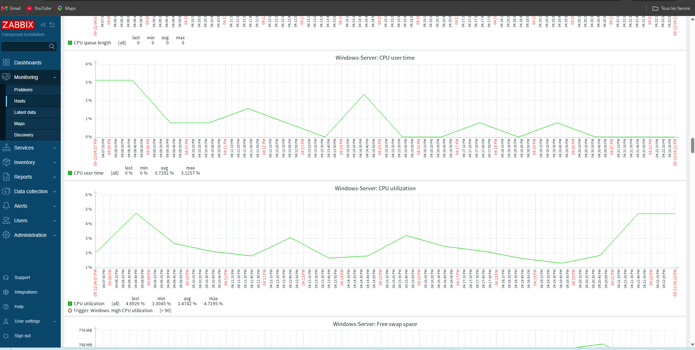
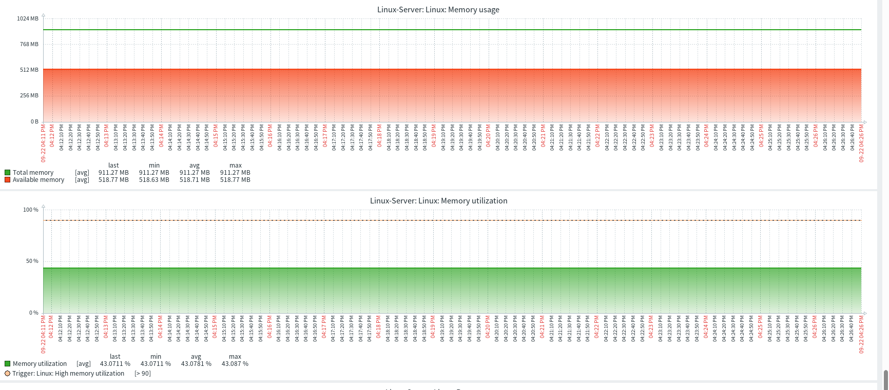
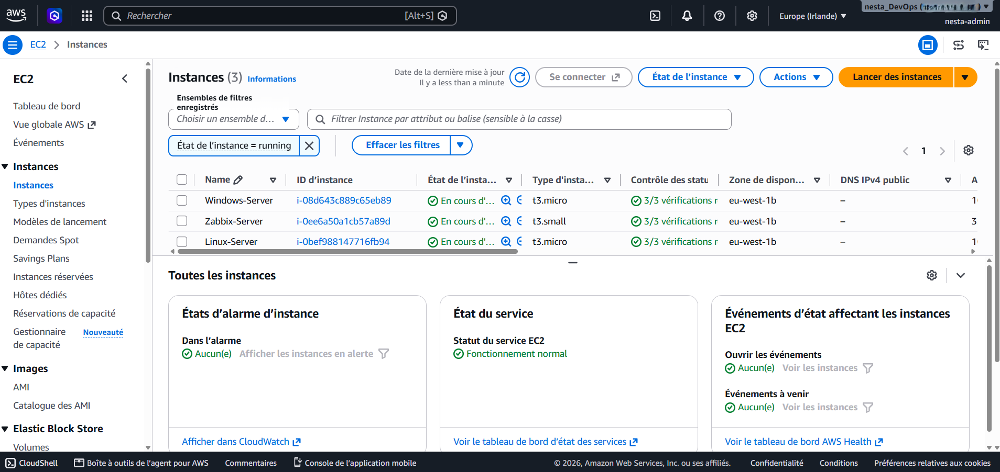
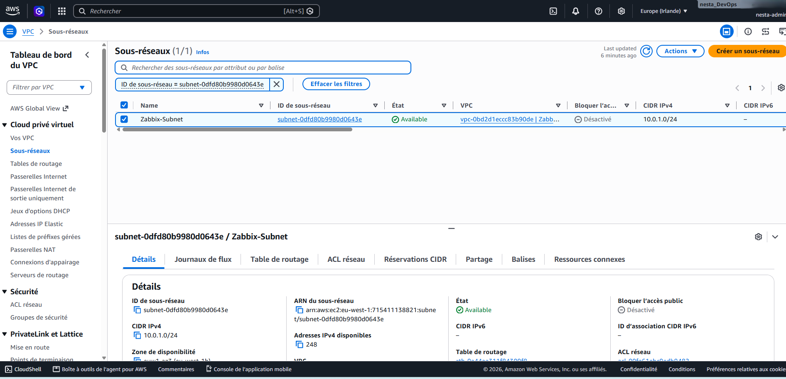
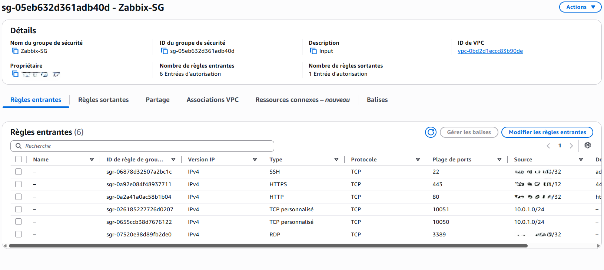
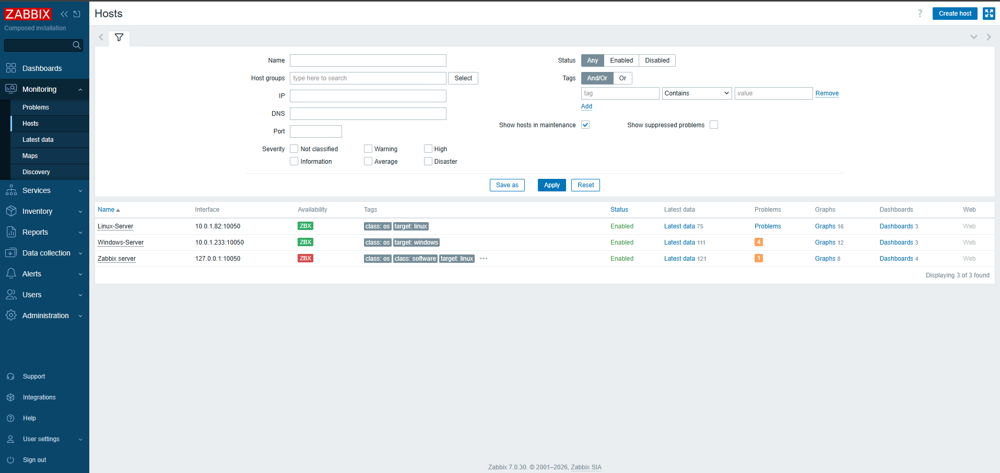

<div align="center">

# ☁️ AWS Zabbix Monitoring Lab

### Supervision centralisée d'une infrastructure Linux & Windows sur AWS


</div>

---

## 🎯 Objectif du projet

L'objectif de ce laboratoire est de déployer sur **AWS** une infrastructure de supervision centralisée avec **Zabbix** afin de monitorer un environnement hybride composé d'un serveur Linux et d'un serveur Windows.

Le projet permet notamment de :

- déployer une infrastructure réseau AWS dédiée ;
- héberger Zabbix Server sur une instance EC2 ;
- conteneuriser Zabbix avec Docker ;
- installer Zabbix Agent 2 sur Linux et Windows ;
- superviser CPU, mémoire, disponibilité et services ;
- détecter automatiquement les indisponibilités ;
- appliquer des règles de sécurité basées sur le principe du moindre privilège.

---

## 🏗️ Architecture

```text
                         INTERNET
                             │
                     Internet Gateway
                             │
                    ┌─────────────────┐
                    │      AWS VPC    │
                    │   10.0.0.0/16   │
                    └────────┬────────┘
                             │
                    ┌─────────────────┐
                    │ Zabbix Subnet   │
                    │  10.0.1.0/24    │
                    └────────┬────────┘
                             │
              ┌──────────────┼──────────────┐
              │              │              │
              ▼              ▼              ▼
      ┌──────────────┐ ┌──────────────┐ ┌──────────────┐
      │ Zabbix Server│ │ Linux Server │ │Windows Server│
      │ 10.0.1.72    │ │ 10.0.1.82   │ │10.0.1.233   │
      │ Docker       │ │ Ubuntu       │ │Windows      │
      │ Zabbix       │ │ Agent 2      │ │Agent 2      │
      └──────────────┘ └──────────────┘ └──────────────┘
```

---

## ☁️ Infrastructure AWS

| Ressource | Configuration |
|---|---|
| VPC | `10.0.0.0/16` |
| Subnet | `10.0.1.0/24` |
| Zabbix Server | `10.0.1.72` |
| Linux Server | `10.0.1.82` |
| Windows Server | `10.0.1.233` |
| Cloud Provider | AWS |
| Monitoring | Zabbix |
| Conteneurisation | Docker |

---

## 🔐 Sécurité réseau

Les règles réseau ont été configurées selon le principe du **moindre privilège**.

| Service | Port | Source |
|---|---:|---|
| SSH | `22` | My IP |
| HTTP | `80` | My IP |
| HTTPS | `443` | My IP |
| RDP | `3389` | My IP |
| Zabbix Agent | `10050` | Réseau privé `10.0.1.0/24` |
| Zabbix Server | `10051` | Réseau privé `10.0.1.0/24` |

### Pourquoi utiliser `My IP` ?

Les ports d'administration comme SSH, RDP et l'interface Web Zabbix ne sont pas ouverts à `0.0.0.0/0`.

Ils sont volontairement limités à l'adresse IP de l'administrateur.

Cela permet de :

- réduire la surface d'attaque ;
- limiter les tentatives de connexion externes ;
- éviter d'exposer inutilement les interfaces d'administration ;
- respecter le principe du moindre privilège.

---

## 🐳 Déploiement de Zabbix avec Docker

Zabbix Server est déployé avec Docker.

Les principaux composants utilisés sont :

- Zabbix Server
- Zabbix Web
- MySQL
- Docker Compose

Démarrage des conteneurs :

```bash
docker compose up -d
```

Vérification :

```bash
docker compose ps
```

Consultation des logs :

```bash
docker compose logs
```

---

## 🐧 Supervision du serveur Linux

Le serveur Linux utilise **Zabbix Agent 2**.

Vérifier le service :

```bash
sudo systemctl status zabbix-agent2
```

Démarrer le service :

```bash
sudo systemctl start zabbix-agent2
```

Arrêter le service :

```bash
sudo systemctl stop zabbix-agent2
```

Redémarrer le service :

```bash
sudo systemctl restart zabbix-agent2
```

Vérifier le port 10050 :

```bash
sudo ss -lntp | grep 10050
```

---

## 🪟 Supervision du serveur Windows

Le serveur Windows utilise également **Zabbix Agent 2**.

Vérifier le service :

```powershell
Get-Service "Zabbix Agent 2"
```

Démarrer le service :

```powershell
Start-Service "Zabbix Agent 2"
```

Arrêter le service :

```powershell
Stop-Service "Zabbix Agent 2"
```

Vérifier le port 10050 :

```powershell
netstat -ano | findstr :10050
```

---

## 📊 Métriques supervisées

Zabbix collecte plusieurs métriques système :

- utilisation CPU ;
- mémoire RAM ;
- espace disque ;
- disponibilité des hôtes ;
- services système ;
- processus ;
- interfaces réseau ;
- charge système.

---

## ✅ Hôtes supervisés

Les deux serveurs sont correctement enregistrés dans Zabbix.

```text
Linux-Server
10.0.1.82:10050
Status : Available

Windows-Server
10.0.1.233:10050
Status : Available
```

Résultats :

- ✅ Linux Server supervisé
- ✅ Windows Server supervisé
- ✅ Collecte des métriques fonctionnelle
- ✅ Communication par IP privées
- ✅ Interface Web Zabbix opérationnelle

---

## 📈 Monitoring CPU Windows

Zabbix collecte les métriques CPU du serveur Windows.



Les métriques observées incluent notamment :

- CPU utilization
- CPU user time
- CPU system time
- CPU queue

---

## 🧠 Monitoring mémoire Linux

La mémoire du serveur Linux est également supervisée.



Les métriques principales sont :

- Total memory
- Available memory
- Memory utilization

---

## 🚨 Simulation d'incidents

Afin de vérifier la capacité de Zabbix à détecter une panne, les agents ont été volontairement arrêtés.

### Linux

Arrêt :

```bash
sudo systemctl stop zabbix-agent2
```

Vérification :

```bash
sudo systemctl status zabbix-agent2
```

Restauration :

```bash
sudo systemctl start zabbix-agent2
```

### Windows

Arrêt :

```powershell
Stop-Service "Zabbix Agent 2"
```

Vérification :

```powershell
Get-Service "Zabbix Agent 2"
```

Restauration :

```powershell
Start-Service "Zabbix Agent 2"
```

Zabbix détecte l'indisponibilité de l'agent puis confirme le retour à l'état normal après redémarrage du service.

---

## ✅ Résultats obtenus

| Test | Résultat |
|---|---|
| Déploiement AWS | ✅ Réussi |
| Configuration du VPC | ✅ Réussie |
| Configuration du subnet | ✅ Réussie |
| Security Groups | ✅ Configurés |
| Zabbix Server | ✅ Fonctionnel |
| Linux Agent | ✅ Fonctionnel |
| Windows Agent | ✅ Fonctionnel |
| Monitoring CPU | ✅ Fonctionnel |
| Monitoring mémoire | ✅ Fonctionnel |
| Détection d'incident | ✅ Fonctionnelle |
| Retour à l'état normal | ✅ Fonctionnel |

---

## 📸 Captures du projet

### Infrastructure EC2



### VPC et Subnet



### Security Group



### Hôtes Zabbix



### Monitoring CPU Windows


### Monitoring mémoire Linux


### Détection d'incident


---

## 🛠️ Technologies utilisées

<div align="center">


</div>

---

## 🧰 Compétences mises en pratique

- AWS
- EC2
- VPC
- Subnetting
- Security Groups
- Linux Administration
- Windows Server
- Docker
- Docker Compose
- Zabbix
- Zabbix Agent 2
- Monitoring
- Networking
- Troubleshooting
- PowerShell
- Bash
- Sécurité Cloud

---

## 🔒 Sécurité du repository

Aucune information sensible ne doit être publiée dans ce repository.

Les éléments suivants doivent être exclus :

```text
AWS Access Key
AWS Secret Access Key
Private SSH Keys
.pem files
Passwords
.env files
Tokens
Credentials
```

Exemple de `.gitignore` recommandé :

```gitignore
.env
.env.*
*.pem
*.key
*.ppk
credentials
.aws/
.vscode/
.DS_Store
Thumbs.db
```

---

## 🚀 Améliorations futures

Les prochaines évolutions possibles sont :

- automatisation de l'infrastructure avec Terraform ;
- Infrastructure as Code ;
- notifications Zabbix par email ;
- HTTPS pour l'interface Web ;
- intégration avec AWS CloudWatch ;
- ajout de Grafana ;
- architecture avec subnets publics et privés ;
- reverse proxy ;
- CI/CD ;
- automatisation complète du déploiement.

---

## 📚 Compétences renforcées

Ce projet m'a permis de renforcer mes compétences en :

- conception d'une architecture réseau AWS ;
- administration Linux et Windows ;
- sécurisation des accès Cloud ;
- conteneurisation avec Docker ;
- monitoring avec Zabbix ;
- collecte et analyse de métriques ;
- détection d'incidents ;
- troubleshooting réseau et système ;
- administration de services Linux et Windows.

---

## 👨‍💻 Auteur

<div align="center">

### Nesta Kengni

**DevOps & Cloud Engineer**

AWS • Docker • Kubernetes • Terraform • Linux • CI/CD • Monitoring

</div>

---

<div align="center">

### ⭐ AWS • DevOps • Cloud • Monitoring • Infrastructure

</div>