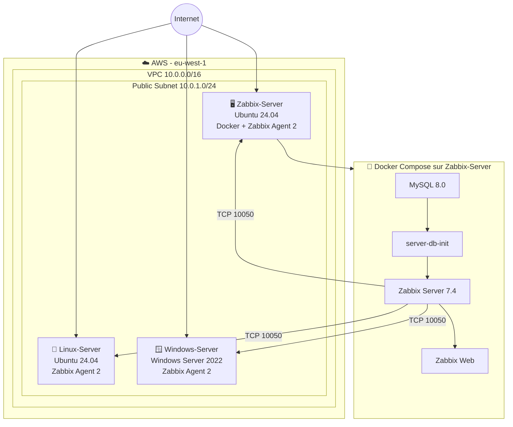
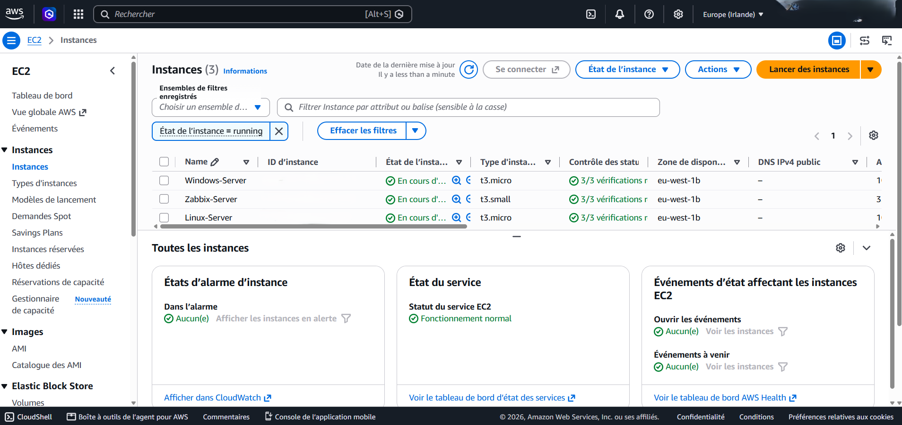
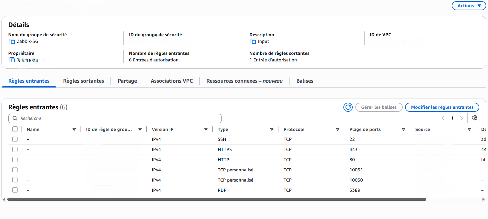
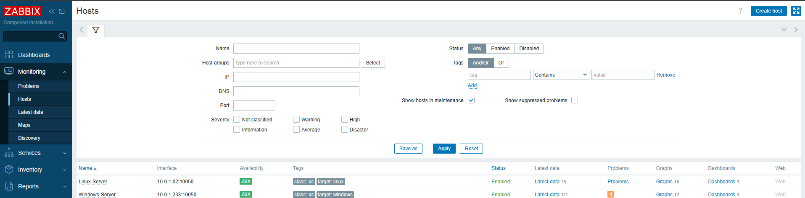
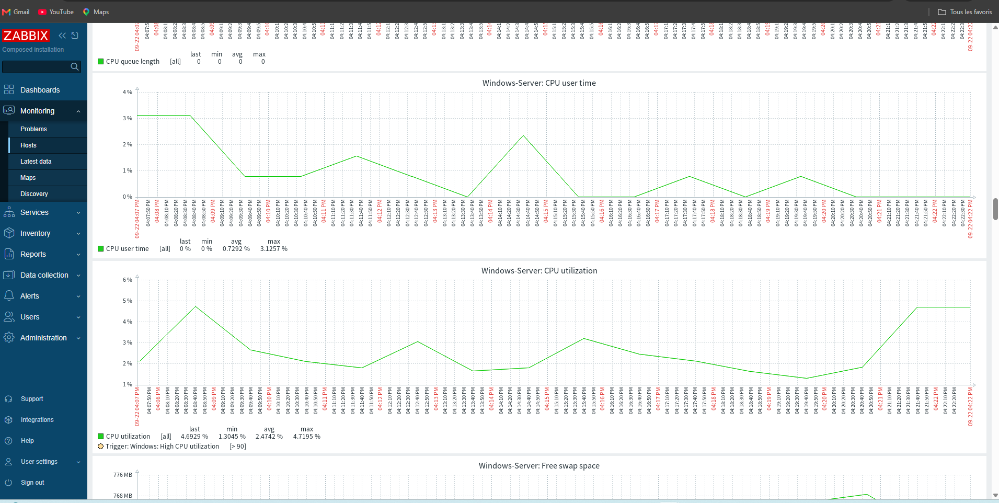
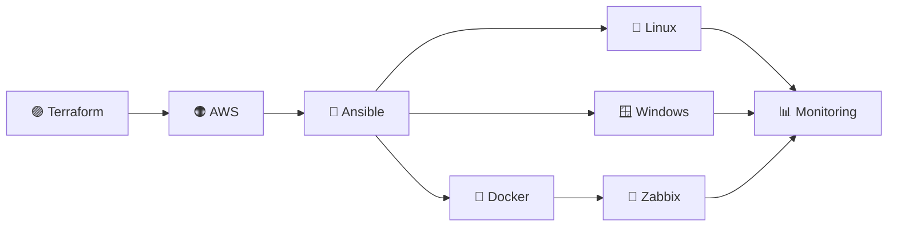

<div align="center">

# ☁️ AWS Zabbix Monitoring Lab

### Infrastructure AWS automatisée avec Terraform, Ansible, Docker et Zabbix

<p>
  
  
  
  
  
</p>

<p>
  
  
  
  
  
</p>

**Projet DevOps & Cloud réalisé pour automatiser le déploiement, la configuration et la supervision d'une infrastructure hybride Linux / Windows sur AWS.**

</div>

---

## 🎯 Objectif du projet

L'objectif de ce lab est de construire une plateforme de supervision centralisée sur AWS en combinant plusieurs briques DevOps :

- **Terraform** pour provisionner l'infrastructure AWS ;
- **Ansible** pour configurer les serveurs Linux et Windows ;
- **Docker Compose** pour déployer Zabbix Server et MySQL ;
- **Zabbix Agent 2** pour superviser Linux, Windows et le serveur Zabbix ;
- **Ansible Vault** pour protéger les secrets ;
- **WinRM HTTPS** pour l'administration automatisée de Windows ;
- des **Security Groups restrictifs** pour appliquer le principe du moindre privilège.

---

## 🏗️ Architecture


```mermaid
flowchart TB
    Internet((Internet))

    subgraph AWS["☁️ AWS - eu-west-1"]
        subgraph VPC["VPC 10.0.0.0/16"]
            subgraph SUBNET["Public Subnet 10.0.1.0/24"]

                ZS["🖥️ Zabbix-Server<br/>Ubuntu 24.04<br/>Docker + Zabbix Agent 2"]
                LS["🐧 Linux-Server<br/>Ubuntu 24.04<br/>Zabbix Agent 2"]
                WS["🪟 Windows-Server<br/>Windows Server 2022<br/>Zabbix Agent 2"]

            end
        end
    end

    subgraph DOCKER["🐳 Docker Compose sur Zabbix-Server"]
        MYSQL["MySQL 8.0"]
        INIT["server-db-init"]
        ZABBIX["Zabbix Server 7.4"]
        WEB["Zabbix Web"]
    end

    Internet --> ZS
    Internet --> LS
    Internet --> WS

    ZS --> DOCKER
    MYSQL --> INIT
    INIT --> ZABBIX
    ZABBIX --> WEB

    ZABBIX -->|"TCP 10050"| LS
    ZABBIX -->|"TCP 10050"| WS
    ZABBIX -->|"TCP 10050"| ZS
```

---

## 🧰 Stack technique

| Domaine | Technologies |
|---|---|
| ☁️ Cloud | AWS, EC2, VPC, Subnet, Internet Gateway, Route Tables |
| 🏗️ Infrastructure as Code | Terraform |
| ⚙️ Configuration Management | Ansible |
| 🔐 Secrets | Ansible Vault |
| 🐳 Conteneurs | Docker, Docker Compose |
| 📊 Monitoring | Zabbix Server 7.4, Zabbix Agent 2 |
| 🐧 Linux | Ubuntu Server 24.04 |
| 🪟 Windows | Windows Server 2022 |
| 🔑 Administration | SSH, RDP, WinRM HTTPS |
| 💻 Scripting | Bash, PowerShell |

---

# 1️⃣ Provisioning AWS avec Terraform

Terraform est utilisé pour créer automatiquement l'infrastructure AWS.

### Ressources créées

- VPC `10.0.0.0/16`
- Subnet public `10.0.1.0/24`
- Internet Gateway
- Route Table
- Association Route Table / Subnet
- Key Pair
- Security Group Zabbix
- Security Group Linux
- Security Group Windows
- EC2 Zabbix Server
- EC2 Linux Server
- EC2 Windows Server

### Structure Terraform

```text
terraform/
├── providers.tf
├── variables.tf
├── main.tf
├── security.tf
├── instances.tf
└── outputs.tf
```

### Commandes principales

```bash
terraform init
terraform fmt
terraform validate
terraform plan
terraform apply
```

Les outputs Terraform permettent ensuite de récupérer les différentes informations nécessaires à l'administration :

```bash
terraform output
```

---

# 2️⃣ Sécurité réseau

Le projet applique le principe du **moindre privilège**.

Les accès administratifs ne sont pas ouverts à tout Internet.

### 🔴 Zabbix Server

| Port | Usage | Source |
|---|---|---|
| `22` | SSH | IP administrateur uniquement |
| `80` | Interface Web Zabbix | IP administrateur uniquement |
| `10050` | Zabbix Agent 2 | Réseau privé AWS |
| `10051` | Zabbix Server | Réseau privé AWS |

### 🟢 Linux Server

| Port | Usage | Source |
|---|---|---|
| `22` | SSH | IP administrateur uniquement |
| `10050` | Zabbix Agent 2 | Réseau privé AWS |

### 🔵 Windows Server

| Port | Usage | Source |
|---|---|---|
| `3389` | RDP | IP administrateur uniquement |
| `5986` | WinRM HTTPS | IP administrateur uniquement |
| `10050` | Zabbix Agent 2 | Réseau privé AWS |

> Les flux de supervision entre Zabbix et les agents utilisent principalement le réseau privé AWS.

---

# 3️⃣ Automatisation avec Ansible

Après le provisioning Terraform, Ansible prend en charge la configuration des machines.

### Structure Ansible

```text
ansible/
├── ansible.cfg
├── inventory.example.ini
│
├── group_vars/
│   ├── zabbix/
│   │   └── vault.example.yml
│   └── windows/
│       └── vault.example.yml
│
└── playbooks/
    ├── zabbix-server.yml
    ├── deploy-zabbix.yml
    ├── linux-agent.yml
    ├── windows-agent.yml
    └── zabbix-server-agent.yml
```

---

## 🐳 Installation de Docker avec Ansible

Le playbook `zabbix-server.yml` automatise notamment :

- installation des dépendances ;
- ajout du dépôt officiel Docker ;
- installation de Docker Engine ;
- installation de Docker Compose ;
- activation du service Docker ;
- ajout de l'utilisateur Ubuntu au groupe Docker ;
- vérification des versions installées.

```bash
ansible-playbook playbooks/zabbix-server.yml
```

---

# 4️⃣ Déploiement Zabbix avec Docker Compose

Le serveur Zabbix est déployé sous forme de conteneurs.

```text
docker/
└── compose.yaml
```

### Services

| Service | Rôle |
|---|---|
| `mysql` | Base de données |
| `server-db-init` | Initialisation contrôlée du schéma Zabbix |
| `zabbix-server` | Moteur de supervision |
| `zabbix-web` | Interface Web |

### Ordre de démarrage

```text
MySQL
  │
  ▼
Healthcheck OK
  │
  ▼
server-db-init
  │
  ▼
Initialisation DB réussie
  │
  ▼
Zabbix Server
  │
  ▼
Zabbix Web
```

Cette organisation évite le problème d'initialisation partielle de la base de données rencontré lors des premiers essais.

---

# 5️⃣ Gestion sécurisée des secrets

Les secrets ne sont **pas stockés en clair dans GitHub**.

Le projet utilise **Ansible Vault** pour protéger notamment :

- mot de passe MySQL ;
- mot de passe root MySQL ;
- mot de passe Administrator Windows.

Les vrais fichiers Vault sont ignorés par Git.

Des fichiers d'exemple sont fournis :

```text
ansible/group_vars/zabbix/vault.example.yml
ansible/group_vars/windows/vault.example.yml
```

Exemple :

```yaml
ansible_password: "CHANGE_ME"
```

---

# 6️⃣ Supervision Linux

Le playbook :

```text
playbooks/linux-agent.yml
```

automatise :

- ajout du dépôt Zabbix 7.4 ;
- installation de Zabbix Agent 2 ;
- configuration du serveur Zabbix ;
- configuration des checks actifs et passifs ;
- configuration du hostname ;
- activation du service ;
- vérification du port TCP `10050`.

### Résultat

```text
Linux-Server
ZBX ✅
```

---

# 7️⃣ Supervision Windows

Windows est administré par Ansible à travers :

```text
WinRM HTTPS
TCP 5986
```

Le playbook :

```text
playbooks/windows-agent.yml
```

automatise :

- téléchargement du MSI Zabbix Agent 2 ;
- installation silencieuse ;
- configuration du serveur Zabbix ;
- configuration du hostname ;
- règle Windows Firewall ;
- démarrage automatique du service ;
- vérification du port TCP `10050`.

### Résultat

```text
Windows-Server
ZBX ✅
```

---

# 8️⃣ Supervision du serveur Zabbix lui-même

Le serveur qui héberge la plateforme de monitoring est également supervisé.

Zabbix Agent 2 est installé directement sur l'instance Ubuntu qui héberge Docker.

Cela permet de surveiller :

- CPU ;
- mémoire ;
- stockage ;
- réseau ;
- uptime ;
- processus ;
- disponibilité système.

### Résultat

```text
Zabbix-Server
ZBX ✅
```

---

# ✅ Résultat final

Les trois serveurs sont désormais supervisés depuis une seule plateforme.

| Hôte | OS | Agent | État |
|---|---|---|---|
| Linux-Server | Ubuntu 24.04 | Zabbix Agent 2 | 🟢 Disponible |
| Windows-Server | Windows Server 2022 | Zabbix Agent 2 | 🟢 Disponible |
| Zabbix-Server | Ubuntu 24.04 | Zabbix Agent 2 | 🟢 Disponible |

---

# 🚨 Détection d'incidents

Le projet ne se limite pas à afficher des métriques.

Des tests d'incidents ont été réalisés afin de vérifier le fonctionnement réel de la supervision :

- arrêt volontaire de Zabbix Agent 2 ;
- indisponibilité temporaire d'un serveur ;
- détection automatique de services Windows arrêtés ;
- remontée d'événements dans l'interface Zabbix ;
- retour automatique à l'état disponible après résolution.

Cela permet de valider :

```text
Détection
   ↓
Création d'un problème
   ↓
Diagnostic
   ↓
Remise en service
   ↓
Retour à l'état OK
```

---

# 📸 Aperçu du projet

## ☁️ Instances EC2



---

## 🔐 Security Groups



---

## 📊 Hosts Zabbix



---

## 📈 Monitoring Windows



---

# 🔄 Workflow DevOps


```mermaid
flowchart LR
    TF["🟣 Terraform"] --> AWS["🟠 AWS"]
    AWS --> ANS["🔴 Ansible"]
    ANS --> LINUX["🐧 Linux"]
    ANS --> WINDOWS["🪟 Windows"]
    ANS --> DOCKER["🐳 Docker"]
    DOCKER --> ZABBIX["🔴 Zabbix"]
    LINUX --> MON["📊 Monitoring"]
    WINDOWS --> MON
    ZABBIX --> MON
```

---

# 🧠 Compétences mises en pratique

<p>
  
  
  
  
  
  
  
  
</p>

- Infrastructure as Code
- automatisation Cloud
- administration Linux
- administration Windows
- configuration réseau AWS
- Security Groups
- Docker / Docker Compose
- Terraform
- Ansible
- Ansible Vault
- SSH
- WinRM
- monitoring
- troubleshooting
- gestion d'incidents
- principe du moindre privilège

---

# 🔮 Améliorations possibles

- génération automatique de l'inventaire Ansible depuis les outputs Terraform ;
- Elastic IP pour stabiliser l'accès public au serveur Zabbix ;
- HTTPS sur l'interface Zabbix ;
- alertes e-mail / Slack ;
- monitoring Docker avancé ;
- pipeline CI/CD pour Terraform et Ansible ;
- backend distant Terraform ;
- stockage du state dans S3 ;
- mécanisme de verrouillage du state ;
- modularisation Terraform ;
- rôles Ansible réutilisables.

---

# 🔒 Sécurité du dépôt

Les éléments suivants sont volontairement exclus du dépôt :

```text
.env
*.pem
*.key
terraform.tfstate
tfplan
ansible/inventory.ini
ansible/group_vars/*/vault.yml
```

Les fichiers `.example` permettent de reproduire le projet sans exposer les secrets utilisés dans l'environnement réel.

---

<div align="center">

## 👨‍💻 Auteur

### Nesta Kengni

**DevOps & Cloud Infrastructure**

[](https://github.com/nestakengni)

[](https://www.linkedin.com/in/nesta-kengni/)

---

⭐ **Si ce projet vous intéresse, n'hésitez pas à consulter le dépôt et les différentes étapes d'automatisation.**

</div>
